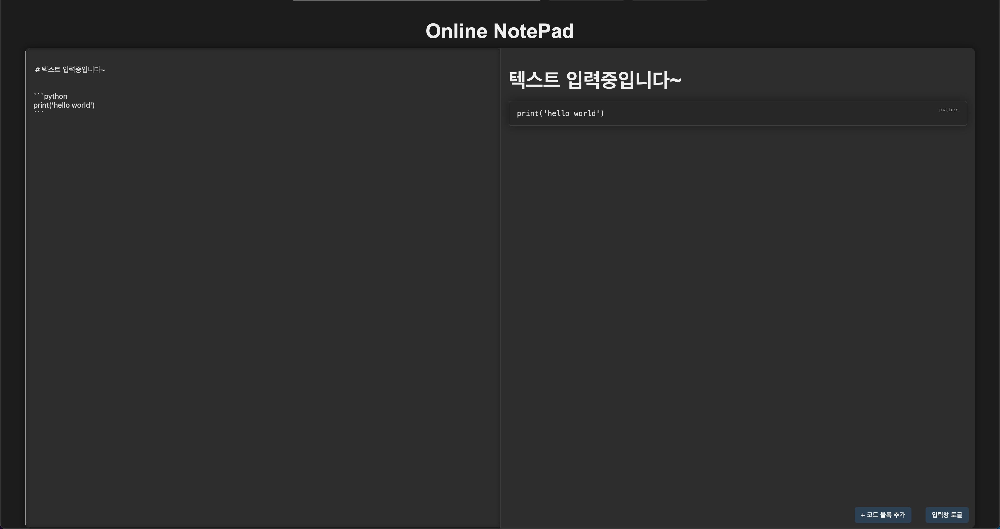
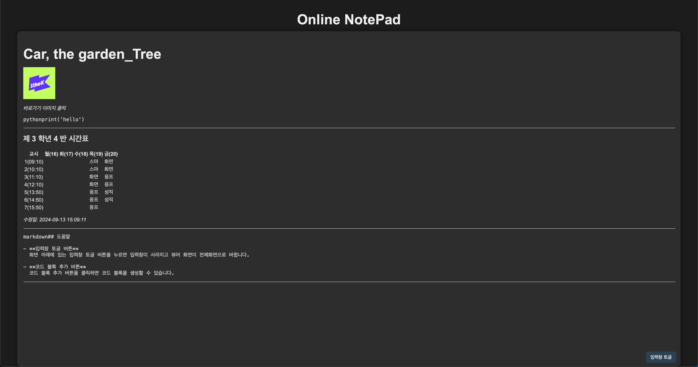

# Unowe Online NotePad


**Unowe Online NotePad**는 실시간으로 메모를 작성하고 공유할 수 있는 온라인 플랫폼입니다. 이 프로젝트는 Node.js와 WebSocket을 활용하여 클라이언트 간의 실시간 데이터 동기화를 구현하였습니다.

## 주요 기능

- **실시간 메모 공유**: 사용자가 작성한 메모는 즉시 모든 클라이언트에게 전송됩니다.
- **코드 블록 지원**: 메모 내에서 코드 블록을 삽입하고 스타일링할 수 있습니다.
- **마크다운 렌더링**: 마크다운 형식으로 작성된 내용을 HTML로 변환하여 시각적으로 표현합니다.
- **입력창 토글 기능**: 메모 입력창을 숨기거나 보이게 할 수 있는 버튼을 제공합니다.

## 기술 스택

- **백엔드**: Node.js, Express
- **프론트엔드**: HTML, CSS, JavaScript
- **실시간 통신**: WebSocket
- **마크다운 처리**: `marked` 라이브러리

## 서버측 코드

```javascript
const express = require('express');
const http = require('http');
const WebSocket = require('ws');
const path = require('path');

const app = express();
const server = http.createServer(app);
const wss = new WebSocket.Server({ server });

// 메모 내용을 저장할 변수
let savedMemo = "";

// 정적 파일 제공 (HTML, CSS, JS)
app.use(express.static(path.join(__dirname, 'public')));

// WebSocket 연결 처리
wss.on('connection', (ws) => {
    console.log('새 클라이언트가 연결되었습니다.');

    // 새로운 클라이언트에게 저장된 메모 전달
    ws.send(savedMemo);

    // 클라이언트로부터 메시지를 받았을 때 처리
    ws.on('message', (message) => {
        const text = message.toString();

        // 저장된 메모를 업데이트
        savedMemo = text;

        // 모든 클라이언트에게 메모 전송
        wss.clients.forEach(client => {
            if (client.readyState === WebSocket.OPEN) {
                client.send(savedMemo);  // 기존 메모를 덮어쓰기
            }
        });
    });

    ws.on('close', () => {
        console.log('클라이언트 연결이 종료되었습니다.');
    });
});

// 서버 실행
server.listen(3001, () => {
    console.log('서버가 http://localhost:3001 에서 실행 중입니다.');
});
```

### 코드 설명

1. **필요한 모듈 로드**: `express`, `http`, `ws`, `path` 모듈을 로드합니다.
2. **서버 및 WebSocket 설정**:
   - `express`를 사용해 HTTP 서버를 설정하고,
   - `ws`를 사용해 WebSocket 서버를 구성합니다.
3. **메모 저장 변수**: `savedMemo` 변수에 현재 메모 내용을 저장합니다.
4. **정적 파일 제공**: `public` 디렉토리의 정적 파일을 서빙합니다.
5. **WebSocket 연결 처리**:
   - 클라이언트가 연결되면 저장된 메모를 전송합니다.
   - 클라이언트가 메모를 전송하면 `savedMemo`를 업데이트하고, 모든 클라이언트에게 메모를 전송합니다.
6. **서버 실행**: 포트 `3001`에서 서버를 실행합니다.

## 클라이언트측 HTML

```html
<!DOCTYPE html>
<html lang="ko">
<head>
    <meta charset="UTF-8">
    <meta name="viewport" content="width=device-width, initial-scale=1.0">
    <title>Unowe NotePad</title>
    <link rel="stylesheet" href="style.css">
    <script src="https://cdn.jsdelivr.net/npm/marked@latest/lib/marked.min.js"></script>
</head>
<body>
    <h1>Online NotePad</h1>

    <div id="container">
        <textarea id="memo" placeholder="메모를 작성하세요..."></textarea>
        <div id="content-container"></div>
    </div>
    
    <button id="toggle-input">입력창 토글</button>
    <button id="add-code-block">+ 코드 블록 추가</button>

    <script src="app.js"></script>
</body>
</html>
```

### 코드 설명

1. **헤더**: HTML 문서의 메타데이터와 스타일 시트, `marked` 라이브러리를 포함합니다.
2. **본문**:
   - 메모를 작성할 `textarea`와 렌더링된 내용을 표시할 `div` 요소가 포함되어 있습니다.
   - `입력창 토글` 버튼과 `코드 블록 추가` 버튼이 있습니다.
3. **스크립트**: 클라이언트측 JavaScript를 포함합니다.

## 클라이언트측 CSS

```css
body {
    font-family: 'Arial', sans-serif;
    display: flex;
    flex-direction: column;
    align-items: center;
    justify-content: center;
    height: 100vh;
    margin: 0;
    background-color: #1e1e1e; /* 다크 배경 */
    color: #e0e0e0; /* 다크 모드 텍스트 색상 */
    padding: 0; /* 패딩 제거 */
    box-sizing: border-box;
}

/* 추가적인 CSS 스타일링 코드... */

pre.code-block {
    position: relative; /* 언어 이름을 표시할 위치 설정 */
    border: 1px solid #444;
    border-radius: 5px;
    padding: 10px; /* 패딩 줄이기 */
    margin-top: 8px; /* 마진 줄이기 */
    margin-bottom: 8px; /* 마진 줄이기 */
    background-color: #2c2c2c;
    color: #e0e0e0;
    white-space: pre-wrap; /* 코드 블록에서 공백 및 줄바꿈 유지 */
    font-family: 'Courier New', Courier, monospace;
    overflow-x: auto; /* 코드가 너무 길면 가로 스크롤 */
    box-sizing: border-box;
    box-shadow: 0 0 15px rgba(0, 0, 0, 0.4); /* 코드 블록 그림자 */
}
```

### 코드 설명

1. **기본 스타일**:
   - 다크 모드 배경과 텍스트 색상 적용.
   - Flexbox를 사용하여 중앙 정렬.
2. **입력창과 콘텐츠 컨테이너**:
   - `textarea`와 `div` 요소의 스타일링.
3. **코드 블록 스타일링**:
   - 코드 블록의 배경색, 텍스트 색상, 패딩, 마진 등을 설정합니다.

## 클라이언트측 JavaScript

```javascript
const socket = new WebSocket('ws://localhost:3001');

const toggleButton = document.getElementById('toggle-input');
const memo = document.getElementById('memo');
const contentContainer = document.getElementById('content-container');
const addCodeBlockButton = document.getElementById('add-code-block');

// 메모가 변경될 때 서버로 전송 (단어가 입력 완료된 후에 전송)
let typingTimer; // 타이머 변수
const doneTypingInterval = 500; // 단어 입력 후 대기 시간 (500ms)

// 토글 버튼 클릭 시 입력창 숨기기/보이기
toggleButton.addEventListener('click', () => {
    memo.classList.toggle('hidden');
    if (memo.classList.contains('hidden')) {
        contentContainer.style.flex = '1'; // 입력창이 숨겨졌을 때
    } else {
        contentContainer.style.flex = '0.5'; // 입력창이 보일 때
        memo.style.flex = '0.5'; // 입력창이 보일 때
    }
});
memo.addEventListener('input', () => {
    clearTimeout(typingTimer);
    typingTimer = setTimeout(() => {
        const message = memo.value;
        socket.send(message);
    }, doneTypingInterval);
});

// 서버에서 받은 메모를 표시
socket.onmessage = (event) => {
    const data = event.data;
    memo.value = data;  // 메모에 직접 반영
    renderContent(data);  // 마크다운 변환 및 표시
};

// 코드 블록 추가 버튼 클릭 시 새로운 코드 블록 생성
addCodeBlockButton.addEventListener('click', () => {
    const cursorPosition = memo.selectionStart;
    const beforeText = memo.value.substring(0, cursorPosition);
    const afterText = memo.value.substring(cursorPosition);
    const newCodeBlock = '\n```\n\n```\n';
    const newCursorPosition = beforeText.length + newCodeBlock.length;
    memo.value = beforeText + newCodeBlock + afterText;
    memo.selectionStart = memo.selectionEnd = newCursorPosition;
    memo.focus();
});

// 마크다운 렌더러 정의
const renderer = new marked.Renderer();

renderer.code = (code, language) => {
    const languageLabel = language ? language : 'plaintext';
    return `<pre class="code-block"><code>${code}</code></pre>`;
};

marked.setOptions({ renderer });

// 마크다운을 HTML로 변환 후 콘텐츠에 표시
const renderContent = (markdown) => {
    const html = marked(markdown);
    contentContainer.innerHTML = html;
};
```

### 코드 설명

1. **WebSocket 연결**: 서버에 WebSocket 연결을 설정합니다.
2. **입력창 토글**:
   - `toggleButton` 클릭 시 입력창을 숨기거나 보이게 합니다.
   - `memo` 요소의 클래스와 스타일을 변경하여 화면을 조정합니다.
3. **메모 전송**:
   - `memo`에서 입력이 완료된 후 서버로 메시지를 전송합니다.
4. **서버 메시지 처리**:
   - 서버에서 받은 메모를 `memo`와 `contentContainer`에 반영합니다.
5. **코드 블록 추가**:
   - `addCodeBlockButton` 클릭 시 코드 블록을 삽입합니다.
6. **마크다운 처리**:
   - `marked` 라이브러리를 사용하여 마크다운을 HTML로 변환하고, 렌더링합니다.

## 화면 미리보기

### 메모 작성 화면



메모를 작성하고 실시간으로 반영되는 화면입니다. 코드 블록 추가 버튼을 클릭하면 마크다운 형식의 코드 블록이 텍스트에 삽입됩니다.

### 마크다운 렌더링



입력된 메모는 마크다운 형식으로 렌더링되어 오른쪽 패널에 실시간으로 표시됩니다. 코드 블록과 같은 특수 형식도 지원됩니다.

## 기여 방법

1. 리포지토리를 [포크](https://docs.github.com/en/get-started/quickstart/fork-a-repo)합니다.
2. 변경 사항을 추가하고, 커밋합니다.
3. [풀 리퀘스트](https://docs.github.com/en/pull-requests/collaborating-with-pull-requests) 생성하여 기여합니다.

---

**Unowe Online NotePad**는 협업과 실시간 데이터 동기화의 좋은 예시로, 최신 웹 기술을 활용하여 실용적인 애플리케이션을 구현한 프로젝트입니다. 더 많은 정보를 원하시면 [GitHub 리포지토리](https://github.com/Hyun647/UnoweOnlineNotePad)를 방문해 주세요.
